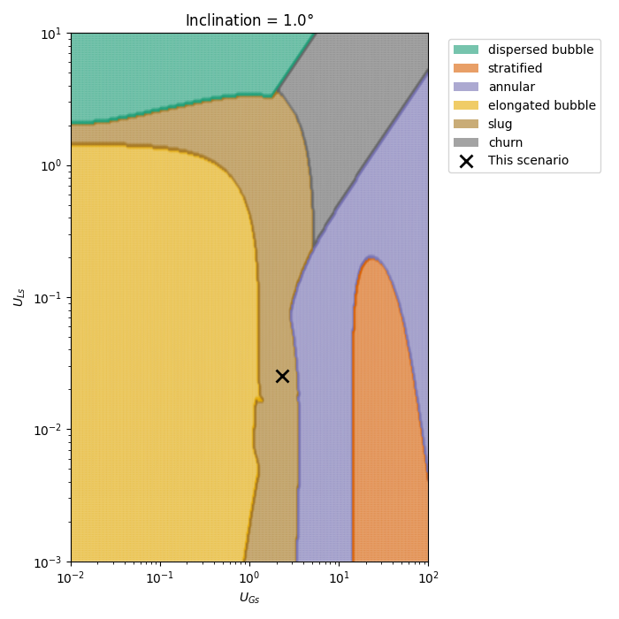

# Two Phase Flow Map

This mapping tool uses a mix of Barnea's 1987 generalized flow map equations and algorithm to generate a two phase flow map at any angle, and some of my own modifications. 

My main modifications involve things like the friction factors used, and some assumed numbers.

## Usage 

The easiest way to use the code is to generate `Liquid`, `Gas` and `Pipe` class instances, plus to generate the 2D velocity data using `generate_data.generate_velocity_maps()`, then generate the map data with `parse_maps.get_category_maps()`, and then pass all the data to the  `visualization.plot_map()` function. See the example below:

```python
import generate_data
import fluids
import parse_maps
import visualization

# generate data
u_ls, u_gs = generate_data.generate_velocity_maps()

# the fluids
liquid = fluids.liquid(
    density=998,
    bubble_surface_tension=0.073, 
    mass_flowrate=1.8,
    dynamic_viscosity=8.9e-4,
)
gas = fluids.Gas(
    density=1.225, 
    mass_flowrate=0.2, 
    dynamic_viscosity=18.3e-6
)
# the pipe
pipe = fluids.Pipe(
    diameter=0.3, 
    inclination=1, 
    roughness=0.001
)

# generate the map's data
category_map = parse_maps.get_categories_maps(
    u_gs, u_ls, liquid, gas, pipe
)

# plot the data
fig, ax = visualization.plot_map(
    category_map, liquid, gas, pipe, u_gs, u_ls
)
```

This will generate the following map 



## Disclaimers and notice

I cannot and don't guarantee the accuracy of these maps, but feel free to use them as base for your own modelling efforts. 

If you like this code or it helped you, please give credit, and you can let me know too. I'd be happy to know that this helped someone. If you need any help or orientation, let me know as well.

If you'd like to contribute, feel free to reach out or create a pull request.
